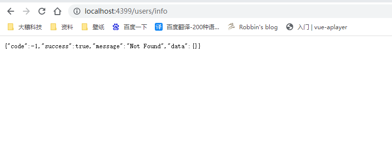
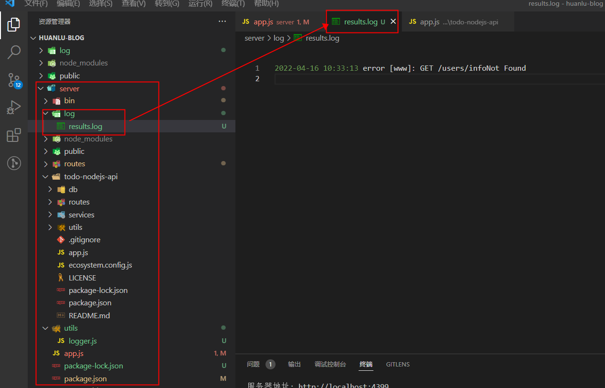

<p class="note note-success"> 当我们通过应用生成器工具 `express-generator` 快速创建一个应用之后。<br/>我们随意还可以使用此结构或修改它以最好地满足我们的需求。
</p>
<!-- more -->

## 1.在代码里修改端口号并控制台输出该 url

在根目录下`bin/www`文件中第 15 行找到`var port = normalizePort(process.env.PORT || "3000");` 3000 就是改服务器的启动端口,我们可以选中修改或不修改。<br/>我在代码中修改端口号为 4399 并且输出了服务地址

`bin/www`

```
#!/usr/bin/env node

/**
 * Module dependencies.
 */

var app = require("../app");
var debug = require("debug")("server:server");
var http = require("http");

/**
 * Get port from environment and store in Express.
 */

var port = normalizePort(process.env.PORT || "4399");
app.set("port", port);

console.log(`服务器地址: http://localhost:${port}`);
/**
 * Create HTTP server.
 */

var server = http.createServer(app);
```

## 2.nodemon 加速开发

[Nodemon](https://www.npmjs.com/package/nodemon) 是一款颇受欢迎的开发服务器，能够检测工作区代码的变化，并自动重启。

通过以下命令安装 nodemon：

```
npm install nodemon --save
```

这里我们将 `nodemon` 安装为依赖。同时我们在 `package.json` 中加入 `start` 命令，代码如下：

`package.json`

```
{
  "name": "server",
  "version": "0.0.0",
  "private": true,
  "scripts": {
    "start": "nodemon ./bin/www",
    "dev": "node ./bin/www"
  },
  "dependencies": {
    "cookie-parser": "~1.4.4",
    "debug": "~2.6.9",
    "express": "~4.16.1",
    "morgan": "~1.9.1",
    "nodemon": "^2.0.15"
  }
}
```

## 3.使用 Winston 库来构建一个简单的日志功能。

[Winston](https://www.npmjs.com/package/winston) 是强大、灵活的 `Node.js` 开源日志库之一，理论上， `Winston` 是一个可以记录所有信息的记录器。这是一个高度直观的工具，易于定制。可以通过更改几行代码来调整其背后的逻辑。它使对数据库或文件等持久存储位置的日志记录变得简单容易。

实践代码将在项目中增加日志功能，安装依赖：

```
npm install winston --save
```

然后建一个`utils`文件夹，用以存放一些常用的公共方法，和一些实用的方法和数据结构.

在`utils`文件夹中新建`logger.js`,代码如下：

`logger.js`

```
const { createLogger, format, transports } = require("winston");
const fs = require("fs");
const path = require("path");

const env = process.env.NODE_ENV || "development";
const logDir = "log";

// Create the log directory if it does not exist
if (!fs.existsSync(logDir)) {
  fs.mkdirSync(logDir);
}

const filename = path.join(logDir, "results.log");

const logger = createLogger({
  // change level if in dev environment versus production
  level: env === "production" ? "info" : "debug",
  format: format.combine(
    format.label({ label: path.basename(process.mainModule.filename) }),
    format.timestamp({ format: "YYYY-MM-DD HH:mm:ss" })
  ),
  transports: [
    new transports.Console({
      format: format.combine(
        format.colorize(),
        format.printf(
          (info) =>
            `${info.timestamp} ${info.level} [${info.label}]: ${info.message}`
        )
      ),
    }),
    new transports.File({
      filename,
      format: format.combine(
        format.printf(
          (info) =>
            `${info.timestamp} ${info.level} [${info.label}]: ${info.message}`
        )
      ),
    }),
  ],
});

module.exports = logger;
```

然后在根目录下的`app.js`文件中引用它

`app.js`

```
// 错误信息返回
var createError = require("http-errors");
var express = require("express");
var path = require("path");
var cookieParser = require("cookie-parser");
var logger = require("./logger");
var morgan = require("morgan");

var indexRouter = require("./routes/index");
var usersRouter = require("./routes/users");

var app = express();

app.use(morgan("dev"));
app.use(express.json());
app.use(express.urlencoded({ extended: false }));
app.use(cookieParser());

app.use(express.static(path.join(__dirname, "public")));

app.use("/", indexRouter);
app.use("/users", usersRouter);

// catch 404 and forward to error handler
app.use(function (req, res, next) {
  next(createError(404));
});

// 接口404生成错误日志
const _errorHeader = (err, req, res, next) => {
  logger.error(`${req.method} ${req.originalUrl}` + err.message);
  const errorMsg = err.message;
  res.status(err.status || 500).json({
    code: -1,
    success: true,
    message: errorMsg,
    data: {},
  });
};

app.use(_errorHeader);

module.exports = app;
```

#### 注意：

引入`logger`前

`var morgan = require("morgan");`之前是`var logger = require("morgan");`<br/>
`app.use(morgan("dev"));`之前是`app.use(logger("dev"));`

然后在路由里接口请求错误 404,`log`文件夹就会生成错误信息了



生成的日志


