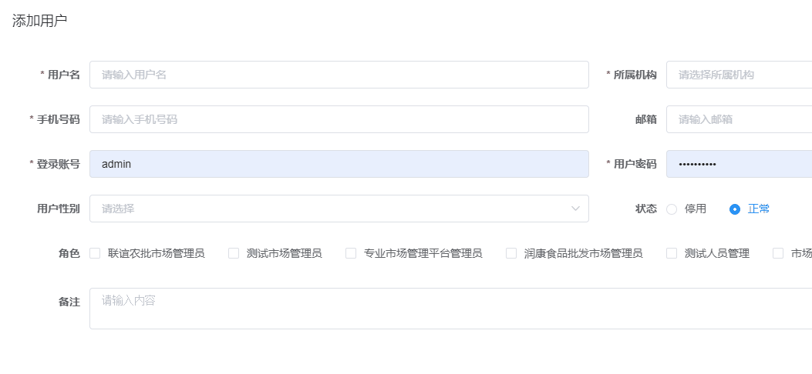
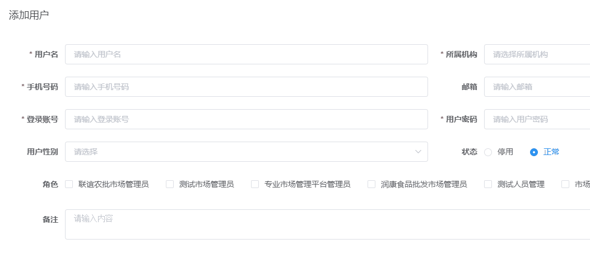

<p class="note note-success"> 今天测试发现手机号可以随便输入文字，让改成只能输入手机号.<br/>我改完这个bug发现输入文字确认以后离开输入框，再输入正确的手机号，Element的表单校验却一直是校验不通过
</p>
<!-- more -->

贴个 bug.gif


### 1.校验规则

首先是手机号校验只能输入数字,并且只能输入 11 位

```
<el-col :span="12">
  <el-form-item label="手机号码" prop="phoneNumber">
    <el-input
      v-model="form.phoneNumber"
      placeholder="请输入手机号码"
      maxlength="11"
      oninput="value=value.replace(/[^\d]/g,'')"
      @input="onPasswordInput"
    />
  </el-form-item>
</el-col>
```

### 2.解决问题

只要在`el-input`组件中加入`@blur="$event => {form.phoneNumber = Number($event.target.value) || '';}"`就解决了。

```
<el-col :span="12">
  <el-form-item label="手机号码" prop="phoneNumber">
    <el-input
      v-model="form.phoneNumber"
      placeholder="请输入手机号码"
      maxlength="11"
      oninput="value=value.replace(/[^\d]/g,'')"
      @blur="$event => {form.phoneNumber = Number($event.target.value) || '';}"
      @input="onPasswordInput"
    />
  </el-form-item>
</el-col>
```

贴个解决了的图



### 3.金额校验

贴个类似的金额校验
<br/>只允许两位小数

```
<el-form-item label="本期应收" prop="fee">
  <el-input
    v-model="form.fee"
    oninput="value=((value.replace(/[^0-9.]/g,'').replace(/^\./g,'').replace('.','$#$').replace(/\./g,'').replace('$#$','.').replace(/^(\-)*(\d+)\.(\d\d).*$/,'$1$2.$3')))"
    @blur="
      $event => {
        this.form.fee = Number($event.target.value) || '';
      }
    "
    placeholder="请输入本期应收"
    size="small"
    :disabled="isOnlyShow"
  >
    <template slot="append">元</template>
  </el-input>
</el-form-item>
```


