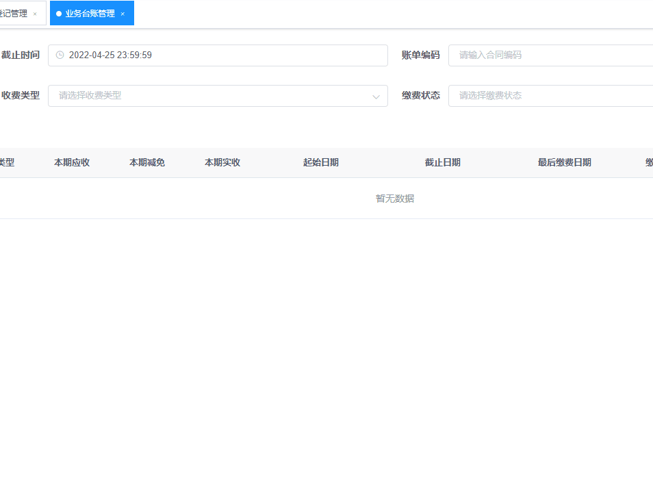

<p class="note note-success"> 好用的开始时间与结束时间比较，结束时间不得大于开始时间并清除结束时间。为了提前规范用户输入数据的正确性，前端要提前判断一些简单的逻辑，引导用户输入合理的数据。
</p>
<!-- more -->



### 1.表单样式

写在`<template>`中或者`<el-dialog>`弹窗里

```
<el-col :span="8">
  <el-form-item label="起始日期" prop="startDate">
    <el-date-picker
      v-model="form.startDate"
      type="datetime"
      placeholder="选择起始日期"
      :picker-options="pickerOptionsStart"
      @change="changeStart"
      size="small"
      :disabled="isOnlyShow"
    >
    </el-date-picker>
  </el-form-item>
</el-col>
<el-col :span="8">
  <el-form-item label="截止日期" prop="endDate">
    <el-date-picker
      v-model="form.endDate"
      type="datetime"
      placeholder="选择起始日期"
      default-time="['23:59:59']"
      :picker-options="pickerOptionsEnd"
      @change="changeEnd"
      size="small"
      :disabled="isOnlyShow"
    >
    </el-date-picker>
  </el-form-item>
</el-col>
<el-col :span="8">
  <el-form-item label="最后截止" prop="lastPayDate">
    <el-date-picker
      v-model="form.lastPayDate"
      type="datetime"
      placeholder="请选择最后缴费日期"
      default-time="['23:59:59']"
      :picker-options="pickerOptionsEndLastPay"
      @change="changeLastPayDate"
      size="small"
      :disabled="isOnlyShow"
    >
    </el-date-picker>
  </el-form-item>
</el-col>
```

### 2.data 定义以及操作方法

```
<script>
export default {
  data() {
    return {
      pickerOptionsStart: {},
      pickerOptionsEnd: {},
      pickerOptionsEndLastPay: {},
    };
  },
  methods: {
    changeStart() {
      // 限制开始时间
      if (this.form.startDate != '') {
        if (this.form.endDate <= this.form.startDate) {
          this.$message.warning('结束时间必须大于开始时间！');
          this.form.startDate = '';
        }
      }
      this.pickerOptionsEnd = Object.assign({}, this.pickerOptionsEnd, {
        disabledDate: time => {
          if (this.form.startDate) {
            return time.getTime() < this.form.startDate;
          }
        },
      });
    },

    changeEnd() {
      // 限制结束时间
      if (this.form.startDate != '') {
        if (this.form.endDate <= this.form.startDate) {
          this.$message.warning('截止时间必须大于起始时间！');
          this.form.endDate = '';
        }
      }

      this.pickerOptionsStart = Object.assign({}, this.pickerOptionsStart, {
        disabledDate: time => {
          if (this.form.endDate) {
            return time.getTime() > this.form.endDate;
          }
        },
      });
      // 限制截至时间
      this.pickerOptionsEndLastPay = Object.assign(
        {},
        this.pickerOptionsEndLastPay,
        {
          disabledDate: time => {
            if (this.form.endDate) {
              return time.getTime() < this.form.endDate;
            }
          },
        },
      );
    },
  },
};
</script>

<style scoped>
</style>

```

一般只需要做开始时间和结束时间，三个事件校验很不好控制容易出问题的。5555~~
